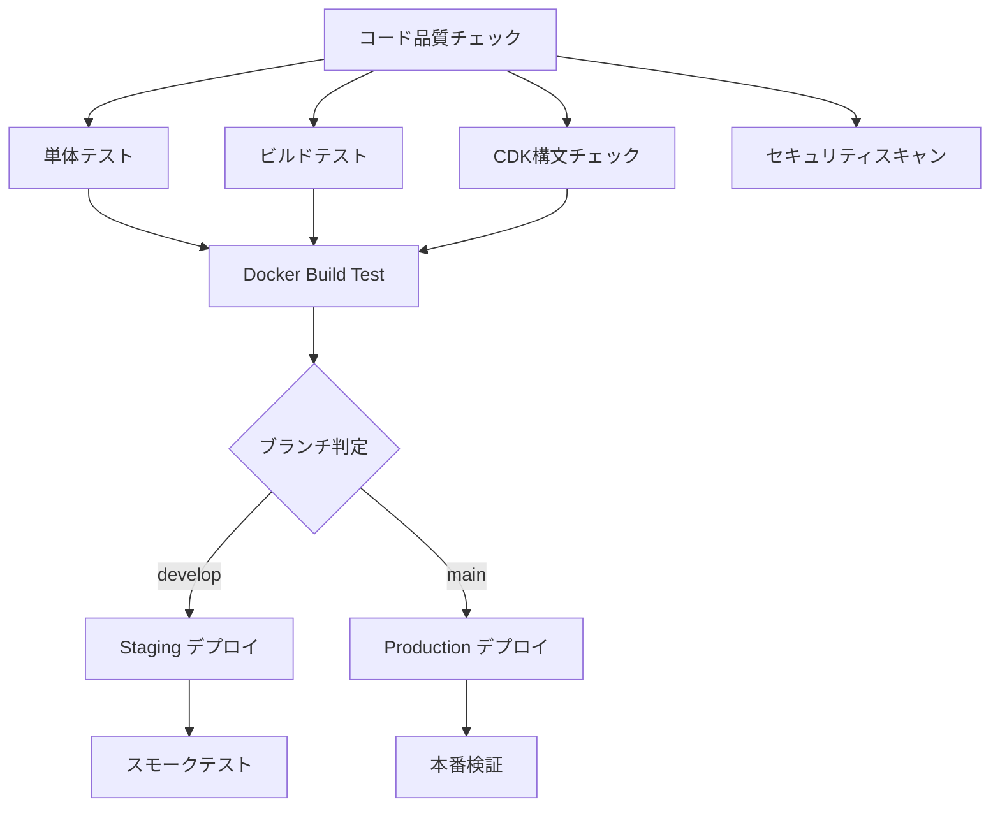

# CI/CD セットアップガイド

## 📋 概要

このプロジェクトでは、GitHub Actionsを使用したCI/CDパイプラインを実装しています。
コード品質チェック、テスト、ビルド、デプロイメントを自動化し、安全で効率的な開発プロセスを提供します。

## 🚀 パイプライン構成

### ブランチ戦略

- **`develop`** ブランチ → Staging環境への自動デプロイ
- **`main`** ブランチ → Production環境への自動デプロイ
- **Pull Request** → コード品質チェックとテスト実行

### パイプラインフロー



## 🔐 必要なシークレット設定

GitHub Repositoryの Settings > Secrets and variables > Actions で以下のシークレットを設定してください：

### AWS認証情報

#### Staging環境
```
STAGING_AWS_ACCESS_KEY_ID
STAGING_AWS_SECRET_ACCESS_KEY
```

#### Production環境
```
PRODUCTION_AWS_ACCESS_KEY_ID
PRODUCTION_AWS_SECRET_ACCESS_KEY
```

### アプリケーション設定

#### Staging環境
```
STAGING_OPENAI_API_KEY          # OpenAI APIキー（Staging用）
STAGING_CROWDWORKS_EMAIL        # CrowdWorksログイン用メールアドレス
STAGING_CROWDWORKS_PASSWORD     # CrowdWorksログイン用パスワード
```

#### Production環境
```
PRODUCTION_OPENAI_API_KEY       # OpenAI APIキー（Production用）
PRODUCTION_CROWDWORKS_EMAIL     # CrowdWorksログイン用メールアドレス
PRODUCTION_CROWDWORKS_PASSWORD  # CrowdWorksログイン用パスワード
```

### その他（オプション）
```
CODECOV_TOKEN                   # Codecovトークン（カバレッジレポート用）
```

## 🏗️ 環境別デプロイメント

### Staging環境
```bash
# developブランチにpushすると自動実行
git checkout develop
git push origin develop
```

### Production環境
```bash
# mainブランチにpushすると自動実行
git checkout main
git push origin main
```

### 手動デプロイ
```bash
# GitHub Actionsの手動実行も可能
# Repository > Actions > CI/CD Pipeline > Run workflow
```

## 🔧 ローカル開発環境での実行

### Docker環境での実行
```bash
# 開発環境起動
npm run docker:dev

# テスト実行
npm run docker:test

# ビルドテスト
docker build --target test -t crowdworks-searcher:test .
```

### ローカルでのCDK操作
```bash
# 構文チェック
npm run cdk:synth

# Staging環境へのデプロイ
npm run cdk:deploy -- --context stage=staging

# Production環境へのデプロイ  
npm run cdk:deploy -- --context stage=production

# リソース差分確認
npm run cdk:diff
```

## 📊 品質ゲート

### コード品質チェック
- **ESLint**: TypeScriptコードの静的解析
- **Prettier**: コードフォーマットの一貫性チェック
- **TypeScript**: 型チェック

### テスト要件
- **単体テスト**: 最低80%のカバレッジ
- **統合テスト**: 主要機能の動作確認
- **ビルドテスト**: コンパイル成功の確認

### セキュリティ
- **npm audit**: 脆弱性のあるパッケージ検出
- **CodeQL**: コードの静的セキュリティ解析

## 🚨 トラブルシューティング

### ビルド失敗時
1. ローカルで `npm run build` を実行
2. TypeScriptエラーを修正
3. `npm run type-check` で型チェック

### テスト失敗時
1. ローカルで `npm run test` を実行
2. 失敗したテストを修正
3. `npm run test:coverage` でカバレッジ確認

### デプロイ失敗時
1. AWS認証情報の確認
2. IAM権限の確認
3. CloudFormationスタックの状態確認

```bash
# AWS CLIでの確認
aws cloudformation describe-stacks --stack-name CrowdWorksSearcherStack-staging
aws lambda list-functions --query 'Functions[?contains(FunctionName, `crowdworks`)]'
```

## 📈 モニタリング

### GitHub Actions
- ワークフロー実行状況: Actions タブ
- 実行時間とリソース使用量の監視

### AWS環境
- Lambda関数のログ: CloudWatch Logs
- エラー監視: CloudWatch Alarms（今後実装予定）

### カバレッジレポート
- Codecov: 自動でカバレッジレポートを生成・表示

## 🔄 継続的改善

### パフォーマンス最適化
- Docker ビルドキャッシュの活用
- 並列ジョブ実行によるパイプライン高速化
- 依存関係のキャッシュ最適化

### セキュリティ強化
- 定期的な依存関係アップデート
- セキュリティスキャンの強化
- シークレット管理の改善

---

## 📞 サポート

CI/CDに関する問題や質問がある場合は、以下を確認してください：

1. **GitHub Actions ログ**: 詳細なエラー情報
2. **AWS CloudFormation**: スタックの状態とエラー
3. **このドキュメント**: 設定手順とトラブルシューティング 