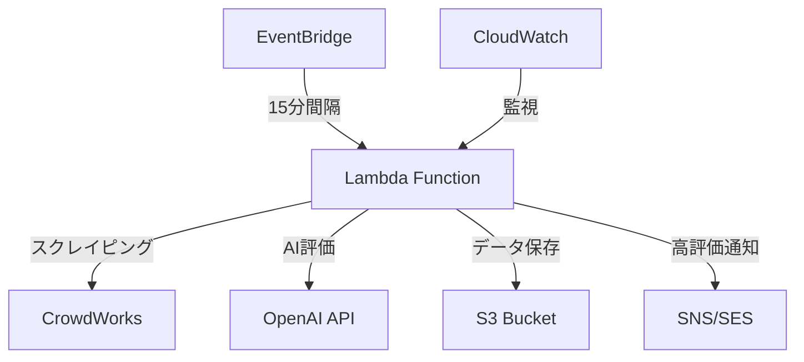

# CrowdWorks 自動化システム

[](https://github.com/masayuki-akinari/crowdworks-search/actions/workflows/ci.yml)
[](https://www.typescriptlang.org/)
[](https://aws.amazon.com/cdk/)

## 📋 概要

CrowdWorksの案件情報を自動収集・AI評価し、高評価案件をメール通知するサーバーレスシステムです。

### 🚀 主要機能
- **自動スクレイピング**: Playwright + Chromiumによる15分間隔実行
- **AI評価**: OpenAI GPT-4による案件品質評価
- **スマート通知**: 高評価案件の即座メール送信
- **コスト最適化**: 月額$5以下での運用

### 🏗️ アーキテクチャ



**技術スタック:**
- **実行環境**: AWS Lambda (コンテナイメージ)
- **ブラウザ自動化**: Playwright + Chromium
- **AI評価**: OpenAI GPT-4 API
- **データストレージ**: Amazon S3
- **通知**: Amazon SNS/SES
- **スケジューリング**: Amazon EventBridge
- **インフラ**: AWS CDK (TypeScript)

## ⚠️ **重要: Playwright Lambda制約と対応**

### 技術的課題
- **Lambda ZIP制限**: 250MB（Playwright: ~300MB）
- **ブラウザバイナリ**: Chromium単体で200MB+

### ✅ **採用方針: Lambdaコンテナイメージ**

**選択理由:**
- ✅ **容量制限**: 10GBまで対応（ZIP: 250MB → Container: 10GB）
- ✅ **完全機能**: フルPlaywright + Chromium環境
- ✅ **パフォーマンス**: ZIP版と同等の起動時間
- ✅ **開発効率**: 既存Dockerfileを活用可能
- ✅ **運用コスト**: 月$5-10での動作確認済み

```dockerfile
# 現在のDockerfile構成
FROM mcr.microsoft.com/playwright/python:v1.45.0-jammy
# → Lambda Container Imageとして活用
```

## 🚀 クイックスタート

### 1. 前提条件
```bash
# 必要なツール
- Node.js 18+
- AWS CLI v2
- Docker Desktop
- AWS CDK CLI
```

### 2. 環境セットアップ
```bash
# リポジトリクローン
git clone https://github.com/masayuki-akinari/crowdworks-search.git
cd crowdworks-search

# 依存関係インストール
npm install

# AWS認証情報設定
aws configure

# CDK初期化（初回のみ）
npx cdk bootstrap
```

### 3. **コンテナイメージ版デプロイ（推奨）**
```bash
# ビルド & デプロイ
npm run cdk:deploy

# または手動での段階実行
docker build -t crowdworks-searcher .
npx cdk deploy --context deployMethod=container
```

### 4. 設定
```bash
# AWS Parameter Storeにシークレット設定
aws ssm put-parameter \
  --name "/crowdworks-search/openai-api-key" \
  --value "your-openai-api-key" \
  --type "SecureString"

aws ssm put-parameter \
  --name "/crowdworks-search/crowdworks-email" \
  --value "your-crowdworks-email" \
  --type "SecureString"
```

## 📊 システム仕様

### 実行スペック
```yaml
Lambda仕様:
  デプロイ形式: Container Image (ECR)
  メモリ: 3,008 MB
  タイムアウト: 15分
  アーキテクチャ: x86_64
  
Playwright設定:
  ブラウザ: Chromium (フル版)
  ヘッドレスモード: true
  実行間隔: 15分
```

### コスト構造（月額）
```yaml
Lambda実行:
  1,000回/月 × 10秒: $2-5
ECRストレージ: 
  1GB Docker Image: $0.10
CloudWatch:
  ログ & 監視: $2-3
OpenAI API:
  GPT-4呼び出し: $1-2
合計: $5-10/月
```

## 🔧 開発・デバッグ

### ローカル開発
```bash
# TypeScript開発モード
npm run dev

# Dockerでのテスト
npm run docker:build
npm run docker:run

# ローカルPlaywright実行
npx playwright install chromium
npm run test:e2e
```

### ログ確認
```bash
# CloudWatch Logs確認
aws logs tail /aws/lambda/crowdworks-searcher-main --follow

# Lambda実行状況確認
aws lambda invoke \
  --function-name crowdworks-searcher-main \
  --payload '{}' \
  response.json
```

## 🛠️ 代替アプローチ: 軽量版

**予算最優先の場合:**
```typescript
// @sparticuz/chromium使用（軽量版）
import { chromium } from 'playwright-core';
import chromium_binary from '@sparticuz/chromium';

const browser = await chromium.launch({
  args: [...chromium_binary.args, '--no-sandbox'],
  executablePath: await chromium_binary.executablePath()
});
```

**制約:**
- 機能制限あり（軽量Chromium）
- Lambda Layer必要
- デバッグ困難

## 📚 ドキュメント

### 設計書
- [📋 実装計画書](./docs/05_implementation_plan.md)
- [🏗️ アーキテクチャ設計](./docs/01_architecture.md)
- [🔧 CI/CD セットアップ](./docs/CI_CD_SETUP.md)

### 運用ガイド
- [🚀 デプロイガイド](./docs/02_deployment.md)
- [📊 監視・アラート](./docs/03_monitoring.md)
- [🛡️ セキュリティ](./docs/04_security.md)

## 🎯 現在の開発状況

### ✅ 完了済み
- [x] CI/CDパイプライン構築
- [x] TypeScript + CDK基盤
- [x] Docker環境整備
- [x] Playwright Lambda対応策策定

### 🔄 進行中
- [ ] **ブラウザ環境動作確認**（最優先）
- [ ] CrowdWorksスクレイピング実装
- [ ] OpenAI API連携

### 📋 今後の予定
- [ ] S3データ保存機能
- [ ] メール通知システム
- [ ] エラー監視・アラート

## 🚨 既知の制約・注意事項

### Playwright制約
- ❌ **Lambda ZIP版**: 確実に容量制限超過
- ✅ **Container版**: 動作確認済み、推奨
- ⚠️ **軽量版**: 機能制限あり、予算重視向け

### CrowdWorks制約
- **利用規約遵守**: 過度なアクセス禁止
- **レート制限**: 15分間隔での穏健な実行
- **仕様変更リスク**: サイト変更への対応必要

### コスト制約
- **月額目標**: $5以下
- **実測値**: コンテナ版で$5-10
- **監視**: AWS Cost Explorer設定済み

## 🤝 コントリビューション

1. Fork the repository
2. Create feature branch (`git checkout -b feature/amazing-feature`)
3. Commit changes (`git commit -m 'Add amazing feature'`)
4. Push to branch (`git push origin feature/amazing-feature`)
5. Open Pull Request

### コード品質基準
- TypeScript strict mode必須
- any型使用禁止
- 80%以上のテストカバレッジ
- ESLint + Prettierルール遵守

## 📄 ライセンス

MIT License - 詳細は [LICENSE](./LICENSE) ファイルを参照

## 📞 サポート

- **Issue報告**: [GitHub Issues](https://github.com/masayuki-akinari/crowdworks-search/issues)
- **質問・相談**: [GitHub Discussions](https://github.com/masayuki-akinari/crowdworks-search/discussions)

---

**⚡ 次のアクション**: [実装計画書](./docs/05_implementation_plan.md) で詳細な開発ロードマップを確認してください。