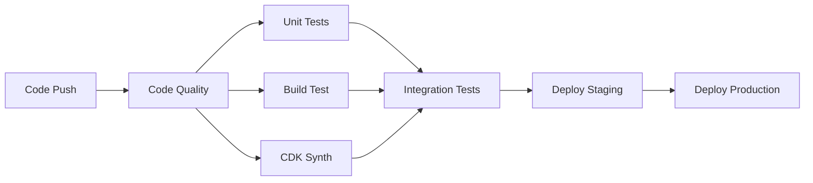

# CrowdWorks Search System

クラウドワークス案件自動検索・評価システム  
AWS Lambda + TypeScript + Docker による サーバレス構成

## 🏗️ アーキテクチャ

- **言語**: TypeScript (strict mode, any型禁止)
- **実行環境**: AWS Lambda (Node.js 18)
- **開発環境**: Docker (Lambda Runtime Interface Emulator)
- **インフラ**: AWS CDK (Infrastructure as Code)
- **CI/CD**: GitHub Actions
- **テスト**: Jest + ts-jest

## 🛠️ 開発環境セットアップ

### 前提条件

- Docker & Docker Compose
- Git
- VS Code (推奨)

### 1. リポジトリクローン

```bash
git clone <repository-url>
cd crowdworks-search
```

### 2. Docker環境での開発開始

```bash
# 開発環境コンテナの起動
docker-compose up -d

# コンテナ内でシェルを開く
docker-compose exec crowdworks-search bash

# または、直接コマンド実行
docker-compose exec crowdworks-search npm run build
```

### 3. 開発用コマンド

```bash
# TypeScript ビルド
npm run build

# 型チェック
npm run type-check

# Lint チェック
npm run lint

# フォーマット
npm run format

# テスト実行
npm test

# カバレッジ付きテスト
npm run test:coverage

# 開発モード（ファイル監視）
npm run dev
```

## 🐳 Docker環境の詳細

### コンテナ構成

```yaml
# メイン開発環境
docker-compose up                    # 開発用コンテナ起動

# テスト専用環境
docker-compose --profile test up     # テスト実行

# CDK専用環境
docker-compose --profile cdk up      # AWS CDK操作

# Lambda環境シミュレーション
docker-compose --profile lambda up   # 本番環境テスト
```

### ディレクトリマウント

```
プロジェクトルート  → /workspace (リアルタイム同期)
~/.aws             → /root/.aws (AWS認証情報)
```

### 環境変数

```bash
# 開発環境
NODE_ENV=development
AWS_REGION=ap-northeast-1
LOG_LEVEL=debug

# テスト環境
NODE_ENV=test
AWS_REGION=ap-northeast-1
```

## 🧪 テスト戦略

### テストの種類

```bash
# 単体テスト
npm test

# 結合テスト  
npm run test:integration

# E2Eテスト
npm run test:e2e

# カバレッジレポート
npm run test:coverage
```

### テスト実行（Docker環境）

```bash
# Docker内でテスト実行
docker-compose --profile test run --rm test

# カバレッジ確認
docker-compose --profile test run --rm test npm run test:coverage
```

## 🏗️ AWS CDK操作

### CDK コマンド

```bash
# CDK専用コンテナ起動
docker-compose --profile cdk up -d

# CDK操作
docker-compose exec cdk cdk synth    # CloudFormation テンプレート生成
docker-compose exec cdk cdk diff     # 差分確認
docker-compose exec cdk cdk deploy   # デプロイ
docker-compose exec cdk cdk destroy  # 削除
```

### 環境別デプロイ

```bash
# Staging環境
docker-compose exec cdk cdk deploy --context stage=staging

# Production環境
docker-compose exec cdk cdk deploy --context stage=production
```

## 📝 コード規約

### TypeScript 設定

- **strict mode**: 有効
- **any型**: 使用禁止 (ESLintエラー)
- **型定義**: 全関数・変数に必須
- **未使用変数**: エラー

### ESLint ルール

```typescript
// ❌ 禁止
const data: any = response;
function process(input) { }

// ✅ 推奨
const data: ResponseData = response;
function process(input: InputData): OutputData { }
```

### ディレクトリ構造

```
src/
├── types/           # 型定義
├── services/        # ビジネスロジック
├── utils/           # ユーティリティ
├── infrastructure/  # AWS CDK
└── lambda/          # Lambda関数
```

## 🚀 CI/CD パイプライン

### GitHub Actions



### 実行タイミング

- **Push to main**: Full pipeline + Staging deploy
- **Pull Request**: Code quality + tests
- **Release tag**: Production deploy (manual approval)

## 🔐 シークレット管理

### GitHub Secrets

```bash
# AWS認証情報
STAGING_AWS_ACCESS_KEY_ID
STAGING_AWS_SECRET_ACCESS_KEY
PRODUCTION_AWS_ACCESS_KEY_ID
PRODUCTION_AWS_SECRET_ACCESS_KEY

# 外部API
OPENAI_API_KEY
CROWDWORKS_EMAIL
CROWDWORKS_PASSWORD
```

### ローカル開発

```bash
# AWS認証情報設定
docker-compose exec crowdworks-search aws configure

# または ~/.aws をマウント（docker-compose.yml設定済み）
```

## 🚀 Lambda デプロイ・テスト

### ローカルでのLambda環境テスト

```bash
# Lambda環境シミュレーション
docker-compose --profile lambda up

# Lambda関数をテスト実行
curl -XPOST "http://localhost:9000/2015-03-31/functions/function/invocations" \
  -d '{"source":"aws.events","detail-type":"Scheduled Event","detail":{}}'
```

### デプロイ手順

```bash
# 1. ビルド確認
npm run build

# 2. CDK 構文チェック
npm run cdk:synth

# 3. Staging デプロイ
npm run cdk:deploy -- --context stage=staging

# 4. Production デプロイ（タグベース）
git tag v1.0.0
git push origin v1.0.0
```

## 📊 監視・ログ

### ログ確認

```bash
# 開発環境ログ
docker-compose logs -f crowdworks-search

# AWS Lambda ログ
aws logs tail /aws/lambda/crowdworks-searcher-main --follow
```

### メトリクス

- **実行時間**: 1分以内目標
- **成功率**: 95%以上
- **月間コスト**: $5以下

## 🔧 トラブルシューティング

### よくある問題

#### TypeScript エラー

```bash
# 型チェック
npm run type-check

# ビルドクリア
npm run clean && npm run build
```

#### Docker ビルドエラー

```bash
# イメージ再ビルド
docker-compose build --no-cache

# ボリューム削除
docker-compose down -v
```

#### Jest テストエラー

```bash
# キャッシュクリア
docker-compose exec crowdworks-search npm test -- --clearCache

# 特定テスト実行
docker-compose exec crowdworks-search npm test -- test/sample.test.ts
```

## 📚 参考資料

- [AWS Lambda Node.js](https://docs.aws.amazon.com/lambda/latest/dg/lambda-nodejs.html)
- [AWS CDK TypeScript](https://docs.aws.amazon.com/cdk/v2/guide/work-with-cdk-typescript.html)
- [TypeScript Strict Mode](https://www.typescriptlang.org/docs/handbook/2/basic-types.html#strictness)
- [Jest Testing Framework](https://jestjs.io/docs/getting-started)

## 🤝 コントリビューション

1. Feature ブランチを作成
2. 変更をコミット
3. テストを実行
4. Pull Request を作成

## 📄 ライセンス

MIT License